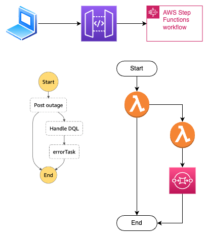

# Krakenflex Tech Test

<br>
My solution is built using AWS CDK and utilizes synchronous express step functions. I chose to use step functions in order to make the program more resilient as it can handle retries out of the box.
<br>
<br>

# Architecture Diagram


<br>
<br>
As you can see we have a an API Gateway / Step Function integration.

The workflow starts with the post quotes lambda, which in the case of a happy path, does all of the heavy lifting and then returns a result. The returned value is then mapped using VTL templates.

If there is an error the workflow wll retry 3 times before following the fail flow, where another lambda will send the data to an SQS queue for manual intervention.
<br>
<br>

# Testing in postman

Use the following CURL request to invoke the api

```
curl --location --request POST 'https://j1r3sbvmh0.execute-api.eu-west-1.amazonaws.com/prod/outages' \
--header 'Content-Type: application/json' \
--data-raw '{
    "forceError": false,
    "siteId": "norwich-pear-tree"
}'
```

An error can be forced by setting the forceError flag to true

<br>
<br>

# Unit and CDK tests

Unit tests and CDK tests will both be run with the command

```
npm run test
```
